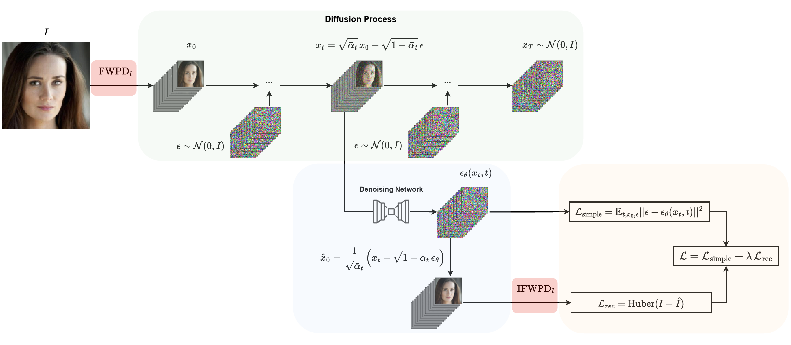
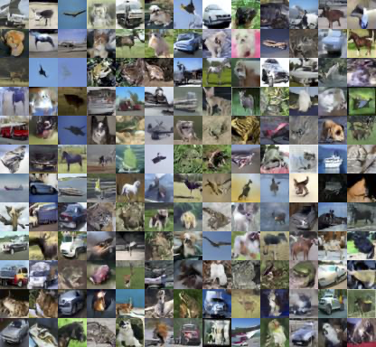
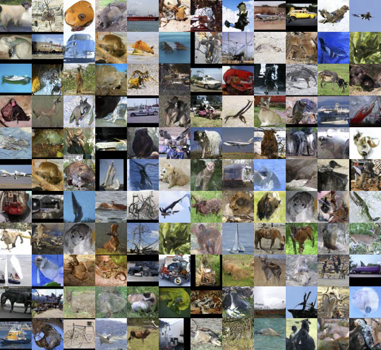

# A Wavelet Diffusion Framework for Accelerated Generative Modeling with Lightweight Denoisers

[](https://huggingface.co/collections/markos-aivazoglou/wavelet-denoising-diffusion-models-689f184bfca03f567fb18f0a)
[](https://creativecommons.org/licenses/by-nc-sa/4.0/)
[](https://www.faiema.org/)
[](https://www.python.org/downloads/)
[](https://pytorch.org/)

This paper has been accepted at [FAIEMA 2025](https://www.faiema.org/).

## Abstract

Denoising diffusion models have emerged as a powerful class of deep generative models, yet they remain computationally demanding due to their iterative nature and high-dimensional input space. In this work, we propose a novel framework that integrates wavelet decomposition into diffusion-based generative models to reduce spatial redundancy and improve training and sampling efficiency. By operating in the wavelet domain, our approach enables a compact multiresolution representation of images, facilitating faster convergence and more efficient inference with minimal architectural modifications. We assess this framework using UNets and UKANs as denoising backbones across multiple diffusion models and benchmark datasets. Our experiments show that a 1-level wavelet decomposition achieves a speedup of up to three times in training, with competitive Fréchet Inception Distance (FID) scores. We further demonstrate that KAN-based architectures offer lightweight alternatives to convolutional backbones, enabling parameter-efficient generation. In-depth analysis of sampling dynamics, including the impact of implicit configurations and wavelet depth, reveals trade-offs between speed, quality, and resolution-specific sensitivity. These findings offer practical insights into the design of efficient generative models and highlight the potential of frequency-domain learning for future generative modeling research.

## Architecture Overview


*Figure 1: Overview of the Wavelet Diffusion Model (WDDM) architecture. The model operates in the wavelet domain, leveraging wavelet decomposition to reduce spatial redundancy and improve training efficiency. The denoising backbone can be a UNet or a KAN-based architecture, allowing for flexible and efficient generative modeling.*

## Samples

<div align="center">


*Figure 2: Uncurated list of samples from the `unet-cifar10-lvl1` model.*

</div>


<div align="center">


*Figure 3: Uncurated list of samples from the `ukan-stl10-lvl1` model*
</div>


## 🚀 Key Features

- **Efficient Training**: Up to 3x faster training compared to standard diffusion models
- **Wavelet-Based Compression**: Operates in wavelet domain for reduced spatial redundancy
- **Multiple Architectures**: Supports multiple denoising backbones such as UNet and U-KAN
- **Flexible Framework**: Compatible with DDPM, DDIM and other standard diffusion solvers
- **Multi-Dataset Support**: Evaluated on CIFAR-10, CELEBA-HQ, and STL-10
- **Parameter Efficiency**: Significant reduction in model parameters while maintaining quality

## 🔧 Installation

```bash
# Clone the repository
git clone https://github.com/markos-aivazoglou/wavelet-diffusion.git
cd wavelet-diffusion

# Create a virtual environment (optional but recommended)
python -m venv venv
source venv/bin/activate  # On Windows use `venv\Scripts\activate`

# Install the required packages
pip install -r requirements.txt

# or for CPU-only installations
pip install -r requirements-cpu.txt  
```

## 📊 Datasets

The framework supports three main datasets:

1. **CIFAR-10**: 32×32 Natural images (60,000 samples)
2. **CelebA-HQ**: 256×256 facial images (30,000 samples) 
3. **STL-10**: 64×64 natural images (100,000 samples)

CIFAR10 and STL10 will be automatically downloaded when first used. For CELEBA-HQ, you need to download the dataset manually and place it in the `data/celeba-hq` directory. The dataset can be downloaded from [CelebA-HQ](https://www.kaggle.com/datasets/badasstechie/celebahq-resized-256x256/data)

## 🏃 Quick Start

### Training a Model

To train a WDDM model, you can either run a plain python command:
```bash
python main.py \
    --model-type UNET \
    --dataset CIFAR10 \
    --num-epochs 700 \
    --train-batch-size 256 \
    --learning-rate 1e-4 \
    --wavelet-level 1 \
    --output-dir ./wddm-cifar10-unet-lvl1
```
or with accelerate for distributed training:
```bash
accelerate launch --config_file config/single-gpu-config.yaml main.py \
    --model-type UNET \
    --dataset CIFAR10 \
    --num-epochs 700 \
    --train-batch-size 256 \
    --learning-rate 1e-4 \
    --wavelet-level 1 \
    --output-dir ./wddm-cifar10-unet-lvl1
```

### Sampling with our pretrained models

```bash
# Generate samples using DDPM
python wavelet_sampling.py \
    --model-dir markos-aivazoglou/wddm-ukan-cifar10-lvl1 \
    --output-dir ./generated-images \
    --model-type UKAN \
    --num-samples 2 \
    --scheduler ddpm \
    --sampling-steps 1000 \
    --prediction-type epsilon
    --device cuda

# Generate samples using DDIM (faster)
python wavelet_sampling.py \
    --model-dir markos-aivazoglou/wddm-ukan-cifar10-lvl1 \
    --output-dir ./generated-images \
    --model-type UKAN \
    --num-samples 2 \
    --scheduler ddim \
    --sampling-steps 50 \
    --prediction-type epsilon
```

### Using Pretrained Models
You can use the pretrained models available on Huggingface Hub or in a local directory, as long as checkpoints are saved with huggingface's `model.save_pretrained("my/local/path")`. For example, to load a pretrained UKAN model for CIFAR-10 and sample with 1000 DDPM sampling steps:
```python
from models.UKAN import UKANHybrid
from diffusion.ddpm import WaveletDiffusion

# Load a pretrained model either from Huggingface Hub or local directory
model = UKANHybrid.from_pretrained("markos-aivazoglou/wddm-ukan-cifar10-lvl1")
diffusion = WaveletDiffusion(
    model=model,
    wavelet_level=1,
    prediction_type="epsilon",
    sampling_mode="ddpm",
    sampling_steps=1000
)
samples = diffusion.sample(batch_size=1)
# do something with the samples
```
or to load a UNet model for CelebA-HQ and sample with 15 DDIM sampling steps:
```python
from diffusers import UNet2DModel
from diffusion.ddpm import WaveletDiffusion

# Load a pretrained model either from Huggingface Hub or local directory
model = UNet2DModel.from_pretrained("markos-aivazoglou/wddm-unet-celeba-hq-lvl1")
diffusion = WaveletDiffusion(
    model=model,
    wavelet_level=1,
    prediction_type="sample",
    sampling_mode="ddim",
    sampling_steps=15
)
samples = diffusion.sample(batch_size=1)
# do something with the samples
```


## 📝 Configuration

The framework can run on Huggingface Accelerate for distributed training and inference.
Training configurations are stored in `config/` directory:

- `single-gpu-config.yaml`: Single GPU  setup
- `multi-gpu-config.yaml`: Multi-GPU distributed training


## 📄 License

This project is licensed under the Creative Commons Attribution Non-Commercial Share-Alike (CC-BY-NC-SA 4.0) - see the [LICENSE](LICENSE) file for details.

## 📚 Citation
TBA


## 👥 Authors

- **Markos Aivazoglou-Vounatsos** - Pioneer Centre for AI, University of Copenhagen
- **Mostafa Mehdipour Ghazi** - Pioneer Centre for AI, University of Copenhagen

## 📞 Contact

For questions feel free to contact:
- Contact the authors at `mav@di.ku.dk` or `ghazi@di.ku.dk`